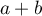

- [asddasd](#org7b3915f)
  - [asds](#org618dda3)
  - [asdsa](#orgcfc553f)

hello




<div class="equation-container">
<span class="equation">

</span>
<span class="equation-label">
1
</span>
</div>


<a id="org7b3915f"></a>

# asddasd


<a id="org618dda3"></a>

## asds


<a id="orgcfc553f"></a>

## asdsa

```matlab
%% Example 1: Fundamental solution
% In this example, we look at grid orientation effects for different
% discretizations
mrstModule add upr                                                    % Generate PEBI grids
mrstModule add incomp mpfa mimetic vem vemmech                        % Incompressible solvers
mrstModule add ad-core ad-props ad-blackoil blackoil-sequential ntpfa % Nonlinear TPFA (requires AD)
```
